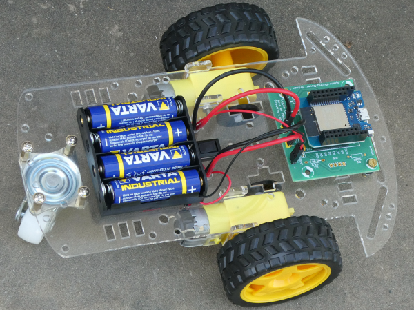

# Creative-lab space mining rover: Snyder 1

## Some infos

The rover is WLAN controlled by a computer or phone. The new  version uses websockets to controll the rover using sliders.
The rover was developed by Jean Daubenfeld and myself for the [creative-lab](http://creative-lab.lu) and was build 35 times on 2 Luxemburgish Makerfest.

## All infos ESP8266 version : <http://www.weigu.lu/microcontroller/rover/index.html>
## All infos ESP32 version : <http://weigu.lu/tutorials/electronics/01_rover/index.html>

